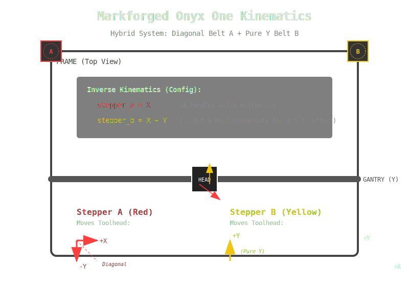

# Markforged Onyx One → Klipper Conversion

[](https://opensource.org/licenses/MIT)
[](https://www.klipper3d.org/Config_Reference.html#printer)

Turn your decommissioned Markforged Onyx One into a fully functional Klipper-based 3D printer.

## What Is This

The Markforged Onyx One is a professional 3D printer with excellent mechanicals that Markforged has abandoned with end-of-life firmware. This project gives it a second life with [Klipper](https://www.klipper3d.org/).

The Onyx One uses a **non-standard hybrid kinematic** — one diagonal belt (CoreXY-style) and one pure Y belt (Cartesian-style). This doesn't map to any standard Klipper kinematic type. We use Klipper's `generic_cartesian` mode to define the exact transform.

## Requirements

- **Klipper** — late 2025+ build with `generic_cartesian` support
- **Controller board** — any board with 4+ stepper drivers. Tested boards:
  - ✅ MKS Gen L V1.0 (confirmed working)
  - ⬜ BTT SKR V1.4 Turbo (untested, pins mapped)
  - ⬜ BTT SKR Mini E3 V3 (untested, pins mapped)
  - ⬜ MKS Robin Nano V3.1 (untested, pins mapped)
- **Klipper host** — Raspberry Pi, Orange Pi, or similar running MainsailOS / FluiddPi
- **Wiring** — you'll need to rewire the Markforged proprietary connectors to your board

## Quick Start

### Option A: Config Generator (Recommended)

👉 **[Open the Config Generator](https://justinh-rahb.github.io/klipper-onyx-one/)** 👈

1. Pick your controller board
2. Adjust options (endstop polarity, thermistor type, etc.)
3. Preview the generated config
4. Download `printer.cfg` + `macros.cfg`
5. Drop onto your Klipper host and go

### Option B: Manual Setup

1. Copy `configs/macros.cfg` to your Klipper config directory
2. Use `configs/printer.cfg.template` as a starting point
3. Replace `{{placeholders}}` with your board's pin assignments (see `configs/boards.json`)
4. Follow the first boot checklist below

## The Kinematics (TL;DR)



The Onyx One has two XY belts:
- **Red belt** (left side) — drives the toolhead diagonally: X+, Y-
- **Yellow belt** (right side + crossbar) — drives the toolhead pure Y+

Klipper's `carriages:` parameter needs the **inverse** transform (stepper position as a function of toolhead position):

```ini
[stepper a]
carriages: x        # stepper_a_position = X

[stepper b]
carriages: x+y      # stepper_b_position = X + Y
```

**Do not use `x-y` and `y`** — that's the forward transform and will cause single-axis moves to only drive one motor, making the toolhead drift.

📖 Full kinematic explanation: [`reference/kinematic_notes.md`](reference/kinematic_notes.md)

## First Boot Checklist

### 1. Flash Firmware
```bash
cd ~/klipper
make menuconfig    # Select your MCU (e.g., ATmega2560 for MKS Gen L)
make
make flash FLASH_DEVICE=/dev/serial/by-id/usb-YOUR-DEVICE
```

### 2. Verify Motor Mapping
```
STEPPER_BUZZ STEPPER="stepper a"   → Red/left motor should buzz
STEPPER_BUZZ STEPPER="stepper b"   → Yellow/right motor should buzz
STEPPER_BUZZ STEPPER="stepper z"   → Z motor should buzz
STEPPER_BUZZ STEPPER=extruder      → Extruder motor should buzz
```
If the wrong motor buzzes → swap the pin definitions between stepper sections.

### 3. Verify Endstops
```
QUERY_ENDSTOPS
```
Manually trigger each optical sensor and re-run. The state should flip. If inverted, adjust the endstop pin prefix (`^!`, `^`, `!`, or none).

### 4. Verify Directions
```
G1 X10 F1000   → toolhead should move right (+X)
G1 Y10 F1000   → toolhead should move forward (+Y)
G1 Z10 F300    → bed down or head up
```
Wrong direction → add or remove `!` on that stepper's `dir_pin`.

### 5. Verify Kinematic Coupling
```
G1 X50 F1000   → BOTH motors should move, toolhead goes purely left/right
G1 Y50 F1000   → BOTH motors should move, toolhead goes purely front/back
```
If pure X commands cause diagonal drift → the `carriages:` values are wrong. See kinematic notes.

### 6. PID Tune
```
PID_CALIBRATE HEATER=extruder TARGET=275
SAVE_CONFIG
```

### 7. Calibrate
- [Rotation distance](https://www.klipper3d.org/Rotation_Distance.html) for all axes
- Extruder e-steps: mark 120mm, extrude 100mm, measure remainder
- Pressure advance (after first successful prints)

## Specs

| Parameter | Value |
|-----------|-------|
| Build volume | 320 × 132 × 154 mm |
| Kinematics | generic_cartesian |
| Bed heater | None (stock) |
| Filament | 1.75mm (designed for Onyx, works with standard filaments) |
| Default hotend temp | 275°C (Onyx) |
| XY belts | GT2 (assumed 20T pulleys = 40mm rotation_distance) |
| Z lead screw | 8mm pitch (verify your machine) |

## Contributing

Got it working on a different board? Open a PR to add your board to `configs/boards.json`. Include:
- Board name and MCU
- Pin mapping (all pins in the template)
- Whether `dir_pin` inversions were needed
- Any notes about wiring or quirks

## License

MIT

## Credits

This project exists because someone refused to let good hardware die, debugged kinematics at 3am, and had the patience to tell an AI "no, it's actually broken" until the math was right.


